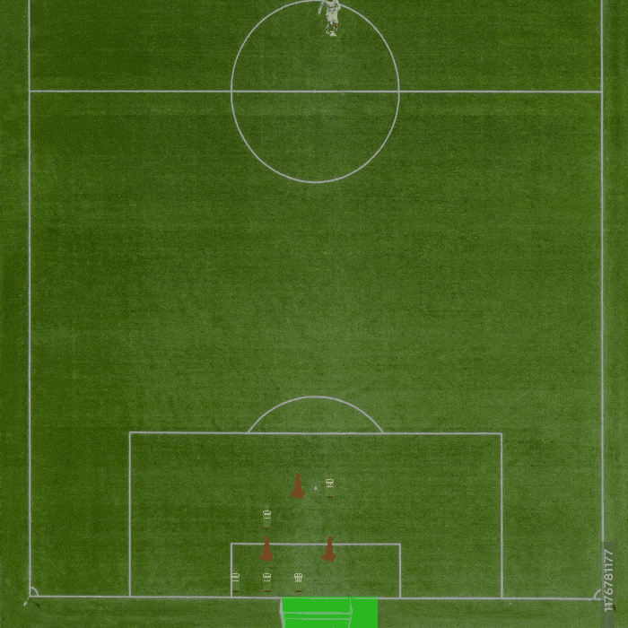

# Reinforcement Learning – Visualizations

## Value Iteration Variants

### Degraded Value Iteration

  

### Finite Horizon Value Iteration

  

### Modified Value Iteration

  

---

## Policy Iteration

  

