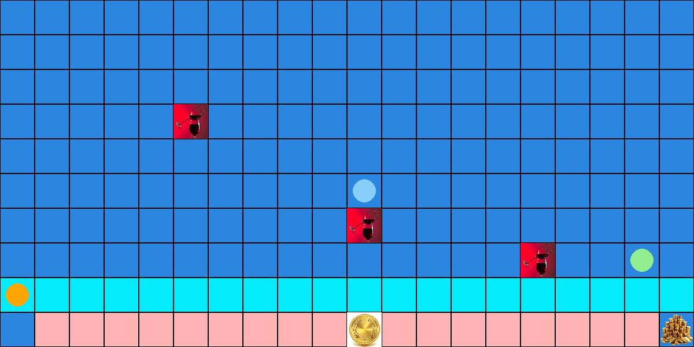
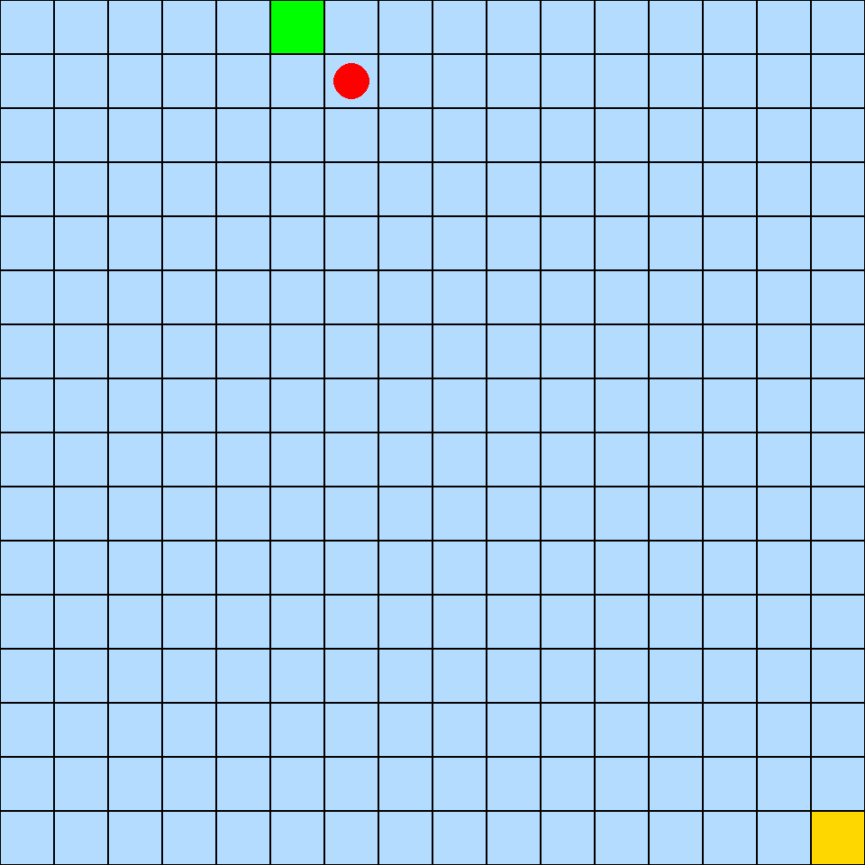
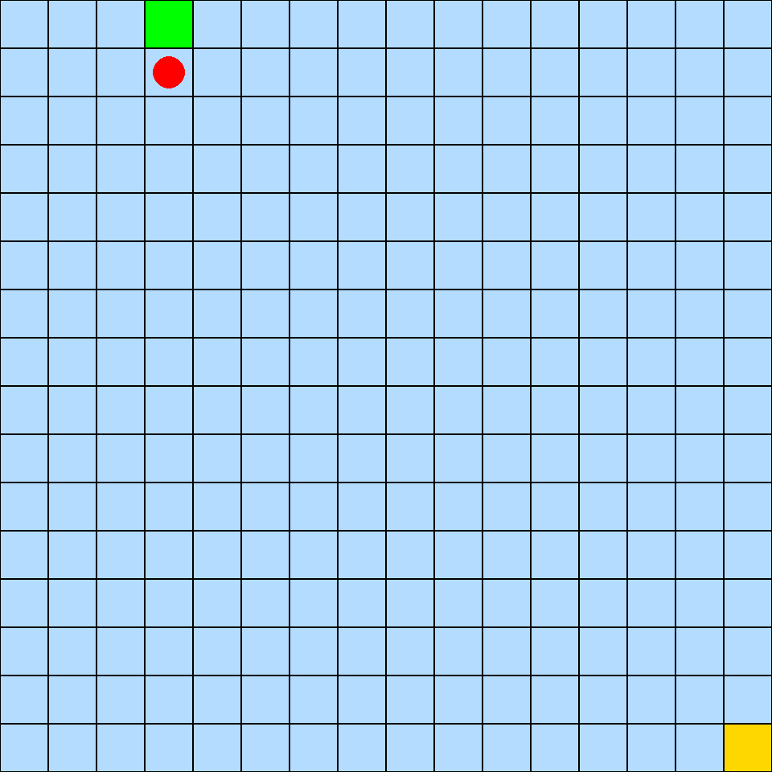
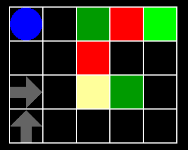

# Reinforcement Learning Algorithms – Visualizations

## SARSA Variants

  
  

---

## Q-Learning

  

---

## FrozenLake Experiments

  
  

---

## Monte Carlo (MC)

  
  
  

---

## Temporal Difference (TD)

  
  
  

---
