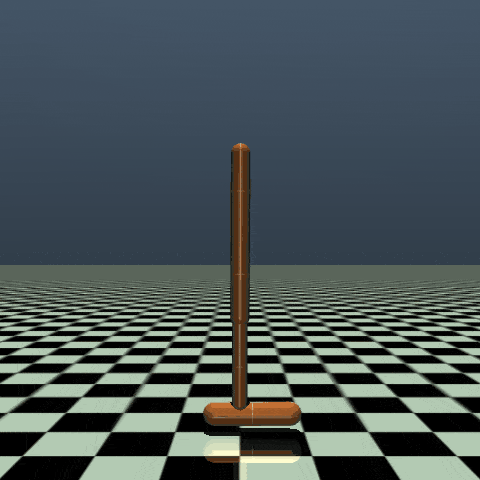
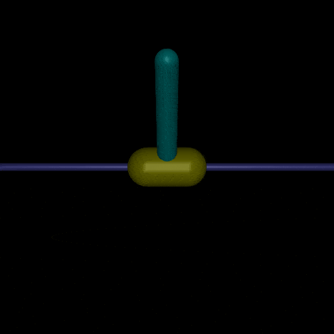
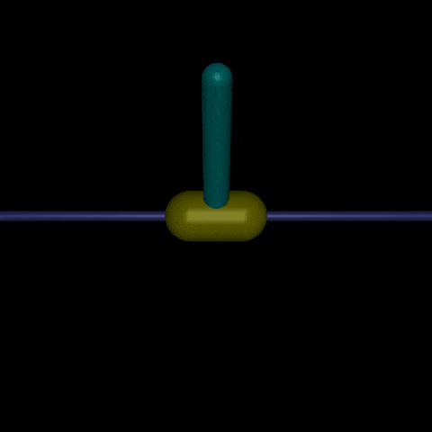
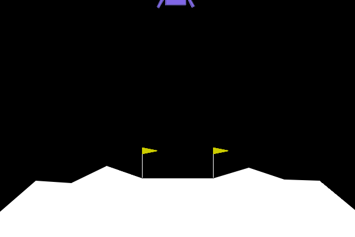
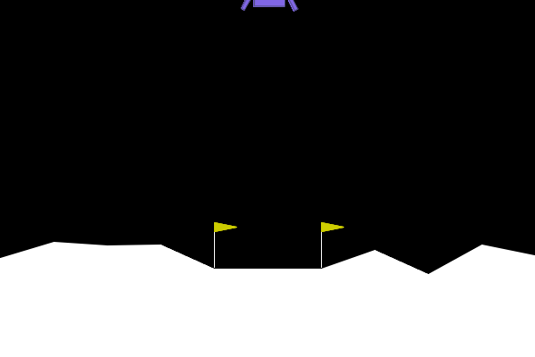
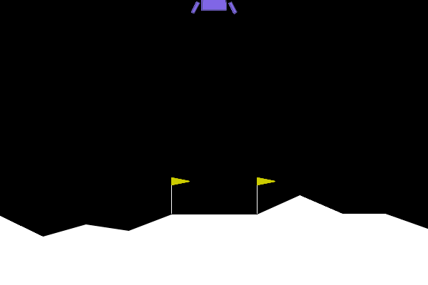

# Reinforcement Learning Results

## A2C Results

  
  
  

  <b>HalfCheetah-v4</b> &nbsp;&nbsp;&nbsp;
  <b>Hopper-v4</b> &nbsp;&nbsp;&nbsp;
  <b>InvertedPendulum-v4</b>

---

## PPO Results

  
  
  

  <b>HalfCheetah-v4</b> &nbsp;&nbsp;&nbsp;
  <b>Hopper-v4</b> &nbsp;&nbsp;&nbsp;
  <b>InvertedPendulum-v4</b>

---

## LunarLander Comparison

  
  
  

  <b>DQN</b> &nbsp;&nbsp;&nbsp;
  <b>DDQN</b> &nbsp;&nbsp;&nbsp;
  <b>A2C</b>

